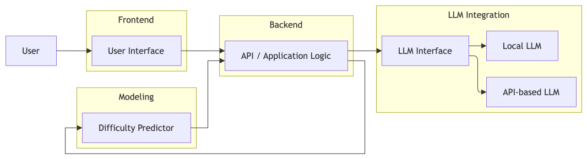
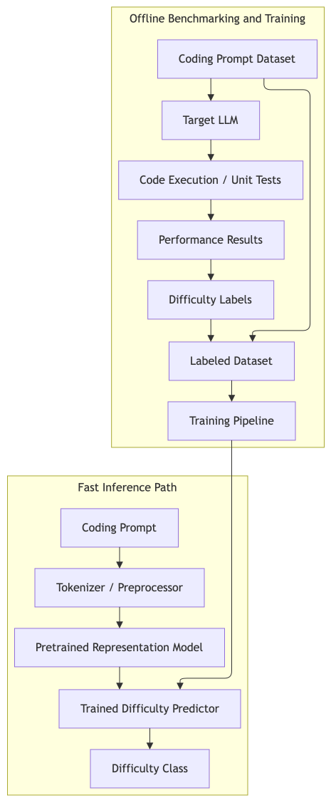
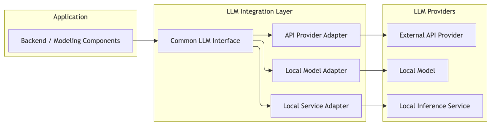
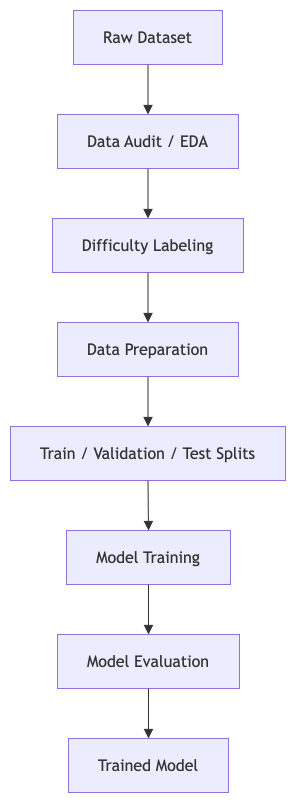
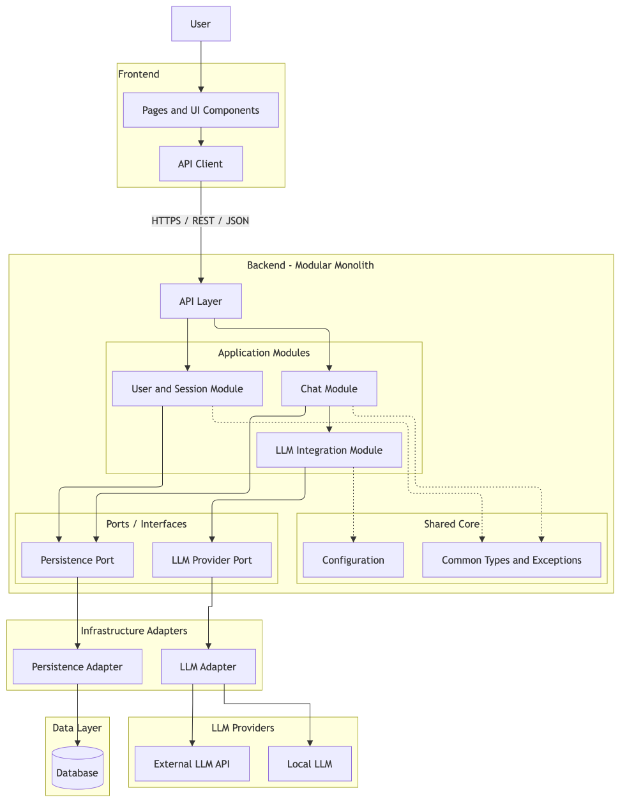
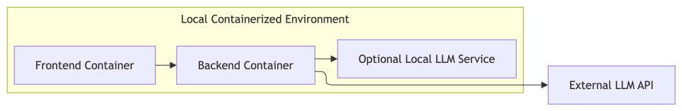

# Architecture Overview

## 1. Purpose

This document describes the general architecture of the Prompt Difficulty Predictor.

The system is designed to estimate the difficulty of coding prompts for a target Large Language Model (LLM) before task execution.

The initial reference LLM will be Llama 3 8B, executed locally through Ollama.

The architecture combines:

- pretrained language representations;
- a custom neural network classifier;
- automated LLM code-generation evaluation;
- isolated execution of generated code;
- a modular LLM integration layer;
- frontend and backend components.

The initial MVP will focus on difficulty prediction using a single reference LLM.

The architecture will support future integration of additional local or API-based LLMs without requiring major changes to the experimental infrastructure.

## 2. General System Architecture

The system is organized into four main components:

- **Frontend**
- **Backend**
- **Modeling**
- **LLM Integration**

The frontend provides the user interface for submitting coding prompts and displaying predicted difficulty classifications.

The backend coordinates application logic, input validation, and difficulty prediction.

The modeling component is responsible for dataset preparation, difficulty labeling, neural network training, and model evaluation.

The LLM integration component provides a common interface for interacting with target LLMs during experimentation.

The initial implementation will use Llama 3 8B through Ollama.

The experimental environment will also include an isolated code execution sandbox for evaluating LLM-generated solutions.

The target LLM and the difficulty prediction model will remain separate components.

The initial prediction workflow will not require executing coding prompts using the target LLM.

## 3. Modeling Architecture

The modeling component develops and evaluates the coding prompt difficulty predictor.

The prediction model uses pretrained language representations and a custom neural network classifier.

The initial inference flow is:

Coding Prompt
→ Preprocessing
→ Tokenization
→ Pretrained Representation
→ Custom Neural Network
→ Predicted Difficulty Class

The pretrained representation component transforms the coding prompt into a semantic feature representation.

The custom neural network uses these features to predict one of four difficulty categories:

- **Easy**
- **Medium**
- **Hard**
- **Cannot Solve**

The target LLM is not part of the difficulty prediction path.

Llama 3 8B will be used during experimentation to generate solutions and establish difficulty labels through automated code evaluation.

The trained neural network will predict difficulty without requiring the target LLM to solve the coding prompt beforehand.

The pretrained representation model and the target LLM will remain independent.

Tokenization will be performed using the tokenizer associated with the selected pretrained representation model.

## 4. Target LLM

The target LLM is the model whose ability to solve coding prompts is being evaluated.

The initial reference model will be Llama 3 8B, executed locally through Ollama.

The target LLM will generate code solutions for programming problems obtained from LiveCodeBench.

Generated solutions will be evaluated using automated test cases.

The observed success rates will be used to assign difficulty labels.

Prompt difficulty is model-dependent.

The same coding prompt may receive different difficulty classifications when evaluated against different target LLMs.

The target LLM will remain separate from the pretrained representation model used by the difficulty predictor.

The architecture will allow additional target LLMs to be integrated in future versions.

However, introducing a new target LLM may require new difficulty labels, model calibration, or retraining of the predictor.

## 5. LLM Integration

The LLM integration component provides a common interface for interacting with target Large Language Models.

The initial implementation will use Llama 3 8B through Ollama.

The integration layer will follow a modular adapter-based design.

Each provider adapter will be responsible for communicating with a specific LLM inference service.

The interface will define common operations for:

- submitting coding prompts;
- configuring generation parameters;
- receiving generated code;
- handling inference errors;
- recording model and execution metadata.

The initial implementation will include an Ollama adapter.

Future implementations may support:

- additional local models;
- alternative inference servers;
- external LLM APIs;
- multiple LLM providers.

Provider-specific logic will remain isolated from the experimental and modeling components.

The experimental pipeline will interact with target LLMs through the common interface rather than directly through provider-specific APIs.

Adding another LLM will not require redesigning the experimental execution infrastructure.

However, difficulty prediction performance must be validated separately for each target LLM.

Detailed interfaces, data formats, and implementation technologies will be defined during development.

## 6. Training and Data Flow

The initial modeling workflow will use LiveCodeBench as the primary source of coding prompts and evaluation test cases.

The experimental pipeline will generate difficulty labels from measurable LLM code-generation performance.

The workflow consists of two main stages.

### 6.1 Difficulty Labeling

LiveCodeBench Dataset
→ Data Audit / EDA
→ Dataset Partition Planning
→ Coding Prompt
→ Llama 3 8B
→ Generated Code
→ Secure Sandbox
→ Automated Test Case Evaluation
→ Success Rate Calculation
→ Difficulty Label

The target LLM will generate code solutions for coding prompts.

Generated code will be treated as untrusted and executed only within an isolated environment.

A generation attempt will be considered successful only when the solution passes all required test cases under the established execution constraints.

Success rates will be calculated from the number of successful attempts relative to the total attempts for each prompt.

The resulting success rates will be used to assign difficulty labels.

The number of generation attempts and the exact difficulty thresholds will be established through experimental analysis.

Difficulty thresholds will be calibrated without using the held-out test set.

The Cannot Solve category will represent prompts for which no successful solution was observed under the established evaluation protocol.

### 6.2 Model Training and Evaluation

Labeled Dataset
→ Data Preparation
→ Tokenization
→ Pretrained Representations
→ Baseline and Neural Network Training
→ Model Validation
→ Final Evaluation
→ Trained Difficulty Predictor

The dataset will be divided into training, validation, and test partitions.

Dataset partitioning will be planned before experimental calibration and model training.

Training and validation data will be used for model development and selection.

The held-out test set will remain independent and will be used only for final evaluation.

The trained classifier will be evaluated using:

- accuracy;
- precision;
- recall;
- macro-F1 score;
- per-class F1-score;
- confusion matrix.

Performance will also be compared against a validated golden reference.

The construction and validation methodology for the golden reference will be defined during the experimental stage.

Raw datasets will remain unchanged.

Experiment configurations, evaluation results, difficulty labels, and metrics will be stored in JSON format.

Model checkpoints will be stored using the appropriate framework-specific format.

All transformations and experimental configurations will be documented to support reproducibility.

### 6.3 Secure Code Execution

The experimental evaluation pipeline will execute code generated by the target LLM.

All generated code will be considered untrusted.

The execution environment must provide isolation from the host operating system.

The sandbox must enforce:

- restricted filesystem access;
- disabled network access by default;
- execution time limits;
- CPU and memory limits;
- process limits;
- execution without unnecessary privileges;
- controlled access to evaluation test cases;
- execution logging and error reporting.

Static validation and pattern matching may be used as additional controls.

However, regular expressions and static filters will not be considered sufficient security mechanisms for executing untrusted generated code.

The final sandbox technology will be selected after evaluating available isolation mechanisms.

Potential mechanisms include hardened containers, additional system-call isolation, and virtualized execution environments.

The sandbox will remain independent from the LLM integration layer.

Only evaluation inputs and authorized resources will be accessible during code execution.

Experimental outputs and execution metadata will be preserved for reproducibility.

## 7. Application Architecture

Once the modeling approach has been validated, the trained difficulty predictor will be integrated into the application.

The application will provide an interface for submitting coding prompts and obtaining predicted difficulty classifications.

The initial runtime flow will be:

User
→ Frontend
→ Backend API
→ Input Validation
→ Preprocessing / Tokenization
→ Pretrained Representation
→ Custom Neural Network
→ Difficulty Prediction
→ Frontend
→ User

The backend will coordinate input validation, model inference, and response generation.

The difficulty predictor will operate independently from the target LLM.

The initial prediction workflow will not require communication with Ollama or execution of generated code.

The LLM integration component will remain available for experimental evaluation and future system extensions.

The initial MVP will not require a database service.

Experimental results and configurations will be stored using JSON files.

Model weights will be loaded from saved checkpoints during inference.

The application logic will remain independent from specific LLM providers and deployment implementations.

## 8. Deployment

The final system is expected to support containerized application deployment.

The main deployable components are:

- frontend;
- backend;
- trained difficulty predictor;
- optional local LLM inference service.

The initial experimental LLM will be Llama 3 8B, executed through Ollama.

The experimental code execution sandbox will remain separate from the application deployment environment.

The sandbox will be implemented during the difficulty-labeling stage.

The final application will not require executing generated code to predict prompt difficulty.

The deployment architecture will prioritize component isolation, reproducibility, and modular integration.

External LLM APIs, when supported in future versions, will remain outside the local container infrastructure.

## 9. Architectural Principles

The architecture will follow these principles:

- separation between modeling and application code;
- independence from a specific LLM provider;
- modular and replaceable system components;
- mandatory tokenization in the modeling pipeline;
- reproducible experimental execution;
- isolation of untrusted LLM-generated code;
- separation between experimental evaluation and difficulty prediction;
- traceability of experiment configurations, results, and model versions;
- preservation of raw datasets;
- prevention of data leakage;
- compatibility with future LLM integrations;
- containerized application deployment.

The initial implementation will prioritize simplicity and reproducibility over unnecessary architectural complexity.

Advanced orchestration systems and autonomous agents will remain outside the initial MVP.

## 10. Current Open Decisions

The following elements remain under evaluation:

- final LiveCodeBench dataset version and partitioning;
- number of code-generation attempts per prompt;
- exact difficulty labeling thresholds;
- final automated code evaluation protocol;
- pretrained representation model;
- custom neural network architecture;
- golden reference construction and validation;
- model acceptance criteria;
- minimum classification performance requirements;
- final sandbox isolation mechanisms;
- final backend framework;
- final frontend framework;
- final deployment configuration;
- detailed component interfaces and data schemas.

The following architectural decisions have already been established:

- the system will focus exclusively on coding prompts;
- LiveCodeBench will be the initial benchmark;
- Llama 3 8B will be the reference LLM;
- Ollama will provide local LLM inference;
- Python will be the main development language;
- tokenization will be mandatory;
- the predictor will use pretrained representations and a custom neural network;
- generated code will be evaluated through automated test cases;
- generated code will be executed in an isolated environment;
- difficulty labels will be based on measured success rates;
- experimental configurations and metrics will be stored in JSON format;
- the application will not require a database service;
- the initial MVP will use a single target LLM;
- multi-model routing will remain outside the initial MVP.

Remaining technical decisions will be resolved during the corresponding development and experimental phases.